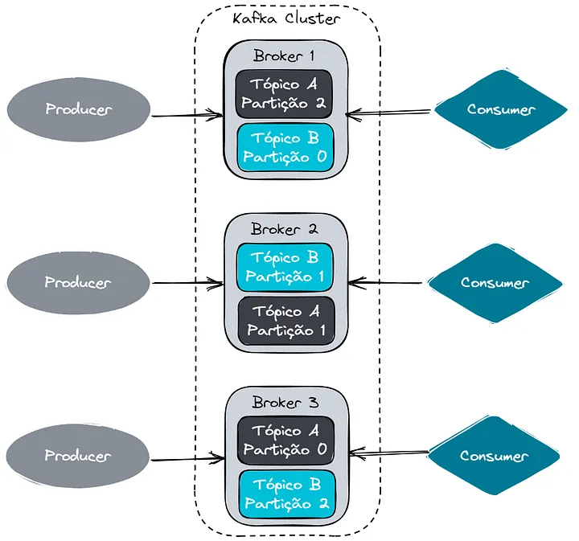

---
presentation:
  width: 1500
  height: 900
  theme: night.css
---

# Descrição do Projeto

Este projeto é uma live sobre RabbitMQ, Kafka e SQS produzida para turma de FSDT da FIAP. Nele, exploramos os conceitos fundamentais dessas tecnologias de mensageiria e mostramos como utilizá-las em sistemas distribuídos.

## Estrutura do Projeto

Neste repositório, você encontrará os consumidores (consumers) para as mensagens. Os produtores (producers) estão disponíveis no repositório do Locatech, que pode ser acessado [aqui - (Repositório da live desbravando Express, tbm para turma FSDT da pós tech FIAP + ALURA)](https://github.com/GustavoLima93/live-desbravando-expressjs).

## Subindo os Containers

Para subir os containers com Kafka e RabbitMQ, utilize os seguintes comandos:

### Kafka
```sh
docker run -d -p 9092:9092 --name broker apache/kafka:latest
```

### RabbitMQ
```sh
docker run -d --name myRabbit -e RABBITMQ_DEFAULT_USER=user -e RABBITMQ_DEFAULT_PASS=123456 -p 5672:5672 -p 8080:15672 rabbitmq:3-management
```
<!-- slide -->

<!-- slide -->

# Live Kafka, RabbitMQ e SQS

<!-- slide -->

## Mensageria

- Mensageria é um conceito que define que sistemas distribuídos, possam se comunicar por meio de troca de mensagens (evento), sendo estas mensagens “gerenciadas” por um Message Broker (servidor/módulo de mensagens).

<!-- slide -->

## Message Broker

- Um Message Broker é que um servidor de mensagens, responsável por garantir que a mensagem seja enfileirada, garantindo que ela fique lá enquanto necessário até que alguém (consumidor) a retire de lá.

**Podemos imaginar um message broker como uma caixa de correios**

<!-- slide -->

## Producer, Eventos, Consumer

- Eventos -> Mensagens enviadas para o Message Broker

- Producer -> Client que envia os eventos para o Message Broker

- Consumer -> Client que consome os eventos do Message Broker


<!-- slide -->

## RabbitMQ

- O RabbitMQ é um broker de mensagens amplamente utilizado para facilitar a comunicação entre sistemas de forma assíncrona.

<!-- slide -->

## Como funciona o RabbitMQ ? 

- Basicamente o RabbitMQ ele funciona atraves de **Exchange** e **Routing**

- **Exchange** no RabbitMQ é um componente que recebe mensagens de produtores e as direciona para filas com base em regras de roteamento.

- **Routing** é o processo de definir como as mensagens são direcionadas de uma exchange para filas específicas, baseado em critérios como chaves de roteamento (routing keys) ou padrões de binding.


<!-- slide -->

## Um pouco sobre exchange no RabbitMQ

- Possui 3 tipos de exchange Direct, Fanout e Topic

- **Direct Exchange:** As mensagens são enviadas diretamente para filas específicas com base em uma routing key exata.

- **Fanout Exchange:** A mensagem é replicada e enviada para todas as filas conectadas à exchange, sem considerar routing keys.

- **Topic Exchange:** Flexível, permite roteamento baseado em padrões de routing keys usando regex, direcionando mensagens para filas que seguem certos padrões de nomes.

<!-- slide -->

## Kafka

- Apache Kafka é um sistema open-source de mensageria do tipo publish/subscribe desenvolvido pela equipe do LinkedIn.

- É uma ferramenta que permite receber e processar dados em tempo real, ou seja, enquanto eles estão sendo gerados.

- Ele é útil para lidar com grandes volumes de informações que chegam de várias fontes ao mesmo tempo.

**O Kafka foi criado para resolver o problema de pipeline de dados do LinkedIn**

<!-- slide -->

## Como funciona o Apache Kafka ?

- **Mensagens:** Um dado (ou evento) no Kafka é chamado de mensagem e um conjunto de mensagens é chamado de lote (ou batch).

- **Tópicos:** Local onde as mensagens são armazenadas.
  
- **Partições:** Os tópicos são divididos em partições.
  
- **Segmentos de log:** As mensagens do Kafka são escritas em arquivos de logs dentro das partições.
  
- **Broker:** É o servidor do Kafka, responsável por receber as mensagens dos producers, escrever as mensagens no disco e disponibilizar para os consumers.
  
- **Producer:** Serviço(s) responsável(eis) por enviar enviar as mensagens para o Kafka.

- **Consumer:** Serviço(s) responsável(eis) por ler as mensagens do Kafka.

<!-- slide -->

## Arquitetura Kafka



<!-- slide -->

## Kafka x RabbitMQ

- No RabbitMQ, o produtor se preocupa em garantir que a mensagem chegue ao consumidor certo, como uma agência de correios que entrega uma carta ao destinatário. Ele usa uma troca, uma fila e um caminho para decidir para onde a mensagem vai. A troca recebe a mensagem, e a chave de roteamento ajuda a direcioná-la à fila correta, onde o consumidor a pegará.

- Já no Kafka, o produtor apenas coloca a mensagem em um lugar (tópico), sem se preocupar se o consumidor já leu ou não, como uma biblioteca que organiza livros nas prateleiras. O consumidor pode pegar e ler as mensagens quando quiser. O Kafka divide os dados em partes menores chamadas partições, e usa o KRaft ou ZooKeeper, um sistema que organiza como essas partições são controladas, para garantir que tudo funcione bem, mesmo se algo falhar.
  
<!-- slide -->

## Kafka x RabbitMQ: Diferenças no Tratamento de Mensagens

- RabbitMQ:

  - Focado na entrega de mensagens ponta a ponta.
  
  - Prioriza determinadas mensagens (filas prioritárias).
  
  - Garante que o consumidor receba a mensagem.
  
  - Mensagens enviadas e recebidas na ordem original.
  
  - Exclui a mensagem após a leitura (ACK).
  
- Kafka:

  - Plataforma de transmissão de eventos distribuída.
  
  - Não suporta filas prioritárias, trata todas as mensagens igualmente.
  
  - Consumidores proativos, rastreiam e leem as mensagens de forma independente.
  
  - Mensagens ordenadas por tópicos e partições.
  
  - Mensagens armazenadas em logs, disponíveis para reprocessamento.

<!-- slide -->

## Quando usar Kafka ou Rabbit

- Kafka:
  - Ideal para reprocessar dados múltiplas vezes (logs, dados de streaming).

  - Latência baixa, ótimo para processamento de dados em tempo real.

  - Melhor escolha para agregação de logs e análise.

- RabbitMQ:

  - Suporta entrega garantida de mensagens (modelo push).

  - Compatível com protocolos antigos (MQTT, STOMP) e mais linguagens de programação.

<!-- slide -->

## SQS

- Serviço de fila hospedada pela AWS
Desacopla sistemas distribuídos e componentes de software

- Suporte a filas FIFO e Dead Letter Queues (DLQ)
  
- API genérica compatível com várias linguagens de programação via AWS SDK

<!-- slide -->

## Benefícios do Amazon SQS

- Segurança: Controle de envio e recebimento com criptografia (SSE e AWS KMS)
  
- **Durabilidade:** Mensagens armazenadas em múltiplos servidores
  
- **Disponibilidade:** Alta disponibilidade e acesso simultâneo
  
- **Escalabilidade:** Escala automaticamente sem necessidade de provisionamento
  
- **Confiabilidade:** Bloqueio de mensagens durante o processamento
  
- **Personalização:** Suporte para mensagens grandes (via S3 ou DynamoDB) e atrasos
